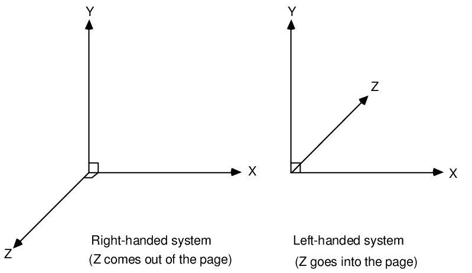
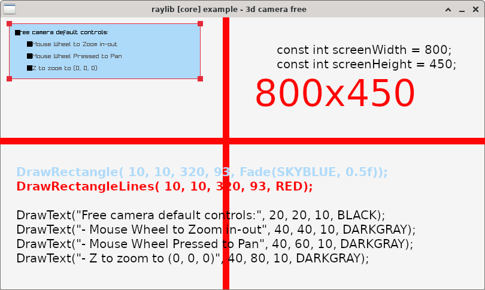

# raylib_notes


**SITE**

https://www.raylib.com/cheatsheet/cheatsheet.html


Raylib uses a right-handed coordinate system for 3D space.

the positive X-axis points right, 
the positive Y-axis points upwards, and the positive Z-axis points towards the viewer when using the "right-hand rule."


**`coordinate system for 3D space:`**




# structs


**normal**


```
#include <stdio.h>

typedef struct Vector2 {
    float x;
    float y;
} Vector2;

int main() {
    Vector2 position = {400, 300};

    printf("Vector2 Position: x = %.2f, y = %.2f\n", position.x, position.y);

    return 0;
}

```


**struct Vector2;**
**struct Vector3;**
**struct Vector4;**
```
#include "raylib.h"
#include <stdio.h>

int main() {
    Vector2 position = {400, 300}; // Define a Vector2
    Vector3 v3 = {1.0f, 2.0f, 3.0f};     // 3D vector
    Vector4 v4 = {1.0f, 2.0f, 3.0f, 4.0f}; // 4D vector

    printf("Vector2 Position: x = %.2f, y = %.2f\n", position.x, position.y);
    printf("Vector3: x = %.2f, y = %.2f, z = %.2f\n", v3.x, v3.y, v3.z);
    printf("Vector4: x = %.2f, y = %.2f, z = %.2f, w = %.2f\n", v4.x, v4.y, v4.z, v4.w);

    return 0;
}

```


```
https://github.com/raysan5/raylib/blob/c647d337034585251d3d76d32093ac88a4c4ab82/src/raylib.h#L228
```


Memory Usage:

    float takes 4 bytes per component, while double takes 8 bytes.
    Using double would increase memory usage and slow down performance.


Data Type	Size (Bytes)	Range
int	4 bytes	-2,147,483,648 to 2,147,483,647
float	4 bytes	~ ±3.4 × 10³⁸ (7 decimal places)
double	8 bytes	~ ±1.8 × 10³⁰⁸ (15-16 decimal places)


Precision

    int can only store whole numbers (e.g., 1, 2, 3, …), which is bad for smooth movement.
    float supports decimals (e.g., 1.5, 2.75), making animations and physics smooth.

Graphics & GPU Compatibility

    Most graphics libraries (OpenGL, Vulkan, DirectX) use float for positions, rotations, etc.

Same Memory Size, More Flexibility

    int and float both take 4 bytes, but float is better for graphics.
    
    
    
    
The compiler automatically treats 1 as 1.0f, 2 as 2.0f, and 3 as 3.0f.    
Best Practice
Vector3 v3 = {1.0f, 2.0f, 3.0f};  // Explicit float values


```
#include "raylib.h"
#include <stdio.h>


#define PI 3.141


#ifndef PI
    #define PI 3.14159265358979323846f
#endif
#ifndef DEG2RAD
    #define DEG2RAD (PI / 180.0f)
#endif
#ifndef RAD2DEG
    #define RAD2DEG (180.0f / PI)
#endif


    float degrees = 90.0f;
    float radians = degrees * DEG2RAD;  // Convert 90° to radians
    float backToDegrees = radians * RAD2DEG;  // Convert back to degrees

    printf("Degrees: %.2f\n", degrees);
    printf("Radians: %.6f\n", radians);
    printf("Back to Degrees: %.2f\n", backToDegrees);
    
```


**camera**


```
https://www.youtube.com/watch?v=RlSpjIb7TLo&ab_channel=DevWorm

```


Right-handed: If you point your right-hand thumb in the +Z direction, curling your fingers shows +X to the right and +Y up.
Used in OpenGL.
DirectX uses a left-handed system (Z-axis flipped).


Column-major means data is stored column-by-column (used in OpenGL).
Row-major means data is stored row-by-row (used in DirectX).


Usage in 3D Transformations

A 4x4 matrix is used for:

    Translation (Move object)
    Rotation (Spin object)
    Scaling (Resize object)
    Perspective Projection
    
    

```

Matrix translationMatrix = {
    1, 0, 0, 5,  // Move 5 units in X
    0, 1, 0, 2,  // Move 2 units in Y
    0, 0, 1, -3, // Move -3 units in Z
    0, 0, 0, 1
};


```


**`module: rtextures:`**




**module: rtextures**


// Draw text (using default font) within an image (destination)


```
void ImageDrawText(Image *dst, const char *text, int posX, int posY, int fontSize, Color color);


DrawText("Free camera default controls:", 20, 20, 10, BLACK);

```


Draws a semi-transparent blue filled rectangle.

```
DrawRectangle( 10, 120, 320, 93, Fade(BLUE, 0.5f));

```


Draws a red outline around the same rectangle.

```
DrawRectangleLines( 10, 120, 320, 93, RED);

```
            


**module rmodels**


```
// Draw a grid (centered at (0, 0, 0))

void DrawGrid(int slices, float spacing);                                                          

DrawGrid(10, 2.0f);

```


Plan_3d view to 2d camera view how work ???


    Camera3D camera = { 0 };
    camera.position = (Vector3){ 10.0f, 10.0f, 10.0f }; // Camera position
    camera.target = (Vector3){ 0.0f, 0.0f, 0.0f };      // Camera looking at point
    camera.up = (Vector3){ 0.0f, 1.0f, 0.0f };          // Camera up vector (rotation towards target)
    camera.fovy = 45.0f;                                // Camera field-of-view Y
    camera.projection = CAMERA_PERSPECTIVE;             // Camera projection type
    
    
    

Camera field-of-view Y


camera.position = (10.0, 10.0, 10.0)

camera.up = (Vector3){ 0.0f, 1.0f, 0.0f }; 


| Direction | X Change | Y Change | Z Change | New Position           | camera.up |
|-----------|----------|----------|----------|------------------------|-----------|
| Front     | 0        | 0        | +5       | (10.0, 10.0, 10.0)      |0.0f, 1.0f, 0.0f |
| Back      | 0        | 0        | -5       | (10.0, 10.0, 5.0)     |0.0f, 1.0f, 0.0f |
| Top       | +5       | +5       | +5       | (15.0, 15.0, 15.0)     |0.0f, 1.0f, 0.0f |
| Bottom    | +5       | -5       | +5       | (15.0, 5.0, 15.0)      |0.0f, 1.0f, 0.0f |
| Left      | +5       | 0        | 0        | (15.0, 10.0, 10.0)     |0.0f, 1.0f, 0.0f |
| Right     | -5       | 0        | 0        | (5.0, 10.0, 10.0)      |0.0f, 1.0f, 0.0f |


Top and Bottom = isometric view 


| Direction | X Change | Y Change | Z Change | New Position           | camera.up |
|-----------|----------|----------|----------|------------------------|-----------|
| Top       | +0       | +5       | +0       | (10.0, 15.0, 10.0)     |0.0f, 0.0f, 1.0f |
| Bottom    | +0       | -5       | +0       | (10.0, 5.0, 10.0)      |0.0f, 0.0f, 1.0f |


| Direction | X Change | Y Change  | Z Change | New Position          | camera.up       |
|-----------|----------|-----------|----------|-----------------------|-----------------|
| Top       | 0        | +5        | 0        | (10.0, 15.0, 10.0)    |1.0f, 0.0f, 0.0f |
| Bottom    | 0        | -5        | 0        | (10.0, 5.0, 10.0)     |1.0f, 0.0f, 0.0f |


CW VS CCW


Position {0.0f, 5.0f, 0.0f} → Places the camera above the cube.
Target {0.0f, 0.0f, 0.0f} → Keeps the cube centered.
Up {0.0f, 0.0f, -1.0f} → Aligns the camera correctly for a top-down view.


--------------------


| Feature             | DrawCube | DrawMesh(GenMeshCube) |
|---------------------|---------|----------------------|
| Easy to Use        | ✅ Yes  | ❌ Requires setup  |
| Performance        | ✅ Fast (built-in) | 🚀 Optimized for models |
| Customizable       | ❌ No   | ✅ Yes (edit vertices, UVs, etc.) |
| Uses Materials     | ❌ No   | ✅ Yes |
| Apply Transformations | ❌ Limited | ✅ Full Matrix control |


How Heightmaps Work

A heightmap is a grayscale image where pixel intensity represents elevation:

    Black (0,0,0) = Lowest elevation.
    White (255,255,255) = Highest elevation.
    Shades of gray = Different heights in between.
    
    
Can I Use Google Maps for Heightmaps?

Yes, but Google Maps images alone are not heightmaps because:

    Satellite images show colors, not elevation.
    You need elevation data (DEM - Digital Elevation Model).
    
How to Create a Heightmap from Google Maps
1️⃣ Download Elevation Data

    Use NASA SRTM, ASTER, or Google Earth Pro to get grayscale elevation maps.
    Websites:
        🌍 https://dwtkns.com/srtm/ (NASA SRTM Data)
        🌍 https://earthexplorer.usgs.gov/ (USGS Earth Explorer)
        
        


Convert to a Heightmap

If you only have a colored map (e.g., from Google Maps), convert it:

    Open in GIMP
    Convert to Grayscale (Image → Mode → Grayscale).
    Adjust Brightness & Contrast (Image → Adjustments → Levels).
    Save as PNG (no color, only black & white).
    
    
    
A grayscale image uses 256 different shades (0–255), where:

    0 (Black) → Lowest height (valleys).
    255 (White) → Highest height (mountains).
    1–254 (Gray levels) → Intermediate heights.

Each pixel in a 8-bit grayscale image has one of 256 values, meaning 256 possible height levels for your terrain.

For higher precision, use 16-bit grayscale (0–65535 levels).


https://www.researchgate.net/publication/241680673_GPU-based_Conformal_Flow_on_Surfaces


Plan mkae own camera postion


        //UpdateCamera(&camera, CAMERA_FREE);
        //UpdateCamera(&camera, CAMERA_THIRD_PERSON);   // best
        //UpdateCamera(&camera, CAMERA_FIRST_PERSON);
        //UpdateCamera(&camera, CAMERA_ORBITAL);
        
        


Timer

```
https://github.com/raysan5/raylib/wiki/Frequently-Asked-Questions

```


Debug info

    //printf("position x: %.2f, position y: %.2f, position z: %.2f\n", x, y, z);
    //printf("texWidth: %.2f, texHeight: %.2f", texWidth, texHeight);


        rlColor4ub(color.r, color.g, color.b, color.a);
        printf("color_r : %.2f,color_g: %.2f,color_b : %.2f,color_a: %.2f", color.r, color.g, color.b, color.a);


The texture is 1024x768.
Each small texture is 256x256.
To calculate how many 256x256 sections can fit into a 1024x768 texture, divide the dimensions of the larger texture by the smaller texture:


To calculate how many 256x256 sections can fit into a 1024x768 texture, divide the dimensions of the larger texture by the smaller texture:

    Width: 1024 / 256 = 4 (so 4 textures fit along the width)
    Height: 768 / 256 = 3 (so 3 textures fit along the height)


float texX = 128.0f / 256;   // 0.5
float texY = 128.0f / 256;   // 0.5


float texX = 1 * 256.0f / texWidth;  // Column 2
float texY = 1 * 256.0f / texHeight; // Row 2


